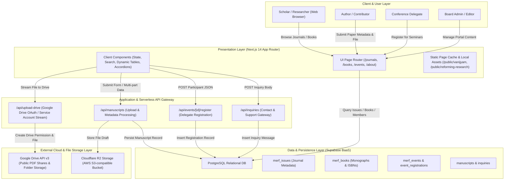
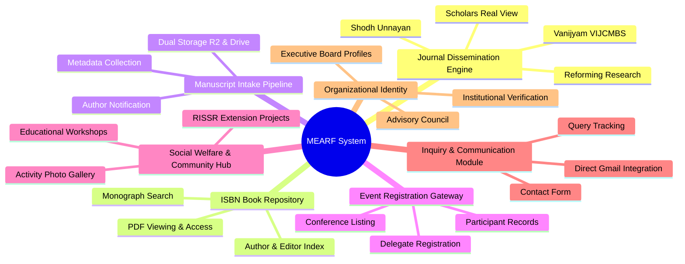
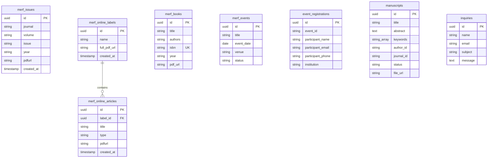
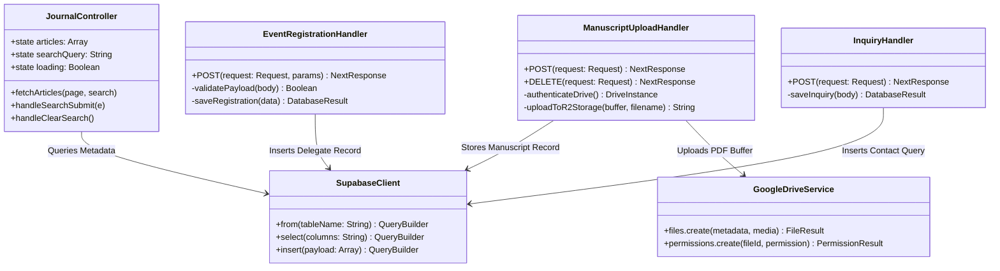
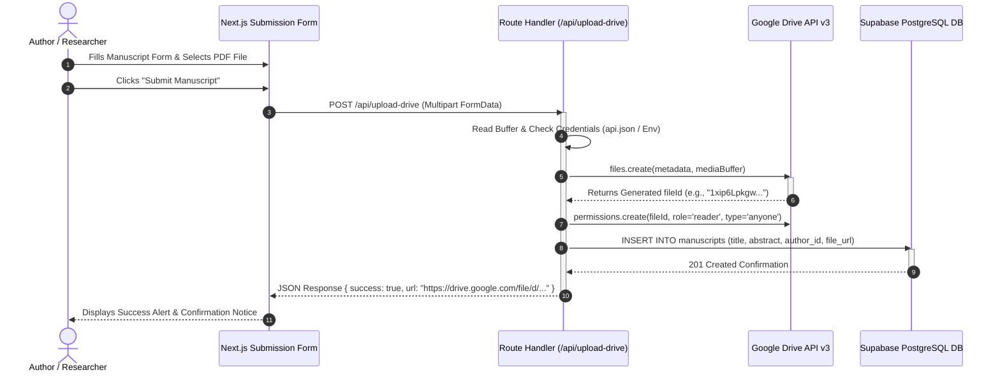
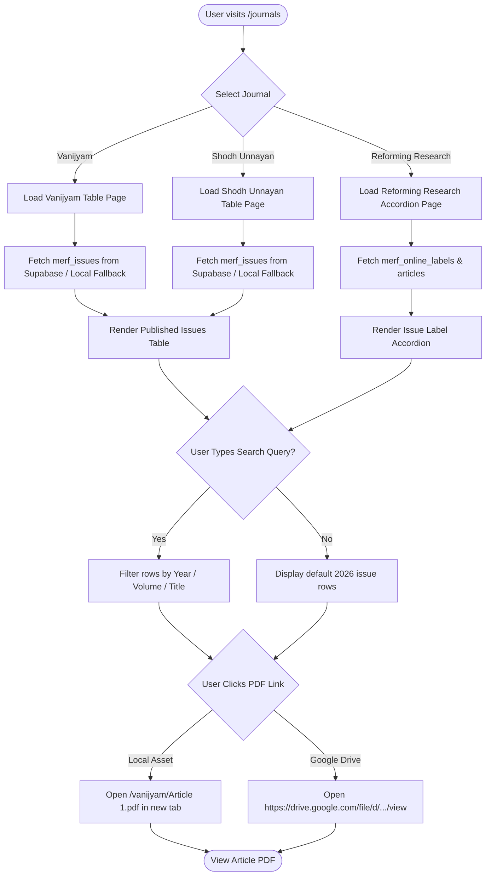

# Maurya Education and Research Foundation (MEARF)
## System Architecture, Component Design, Diagrams, and Operational Workflow Specification

---

## Executive Summary
This document provides a comprehensive technical design specification for the **Maurya Education and Research Foundation (MEARF)** Web Portal and Academic Research Dissemination Platform. Built on Next.js 14 App Router, Supabase Backend-as-a-Service (BaaS), and Cloud Storage integration (Google Drive API and Cloudflare R2 / AWS S3), the system handles open-access journal dissemination, ISBN monograph publishing, manuscript submissions, conference registrations, and institutional social welfare management.

---

# Section A: Overall Architecture of the Proposed System

## A.1 Architectural Overview & Design Paradigm
The MEARF platform adopts a modern **Decoupled Serverless Tiered Architecture**. The application separates client-side interactivity, serverless middleware execution, relational data storage, and external file hosting into isolated layers to achieve high performance, security, and zero-cost scaling.

Key architectural characteristics include:
- **Presentation Layer (Frontend)**: Developed using Next.js 14 Client & Server Components with Vanilla CSS custom design tokens, CSS Grid, and responsive layout primitives.
- **Application & API Gateway Layer**: Next.js Serverless Route Handlers executing on Vercel Edge Network for handling API logic, validation, buffer streams, and OAuth token refreshes.
- **Data & Persistence Layer**: PostgreSQL hosted on Supabase BaaS utilizing Row Level Security (RLS), real-time query acceleration, and RESTful/GraphQL client interfaces.
- **Cloud File Storage & Media Layer**: Dual cloud storage pipeline supporting static local caching (`/public`), Google Drive API v3 (for peer-reviewed journal PDFs and manuscripts), and Cloudflare R2 S3-compatible storage.

---

## A.2 Overall System Architecture Diagram



---

## A.3 Layer-by-Layer Architectural Specification

### 1. Presentation Layer (Frontend)
- **Framework**: Next.js 14 App Router using React Server Components (RSC) for SSR static delivery and Client Components (`'use client'`) for interactive dynamic tables, search filters, and lightboxes.
- **Styling Paradigm**: Vanilla CSS Design Tokens (`globals.css`), supporting dark/light container styling, custom CSS grid layouts, and glassmorphism UI cards.
- **Routing Structure**:
  - `/` - Foundation Overview & Portal Dashboard
  - `/about` - Organizational Profile & Executive Board Members
  - `/journals` - Multidisciplinary Academic Publishing Portal (`/shodh-unnayan`, `/vanijyam`, `/scholars-real-view`, `/reforming-research`)
  - `/books-publications` - ISBN Book & Monograph Catalogue
  - `/events` - Seminars, Conferences, and Registration Gateways
  - `/social-welfare` - Community Projects & Extension Activities
  - `/contact` - Official Communication & Inquiry Form

### 2. Application & Middleware Gateway Layer
- **Serverless API Routes**:
  - `POST /api/upload-drive`: Multi-part stream endpoint that authenticates with Google Drive API v3 using Service Account or OAuth2 Refresh Token credentials. Creates public reader permissions and returns formatted view URLs (`https://drive.google.com/file/d/{fileId}/view`).
  - `POST /api/manuscripts`: Validates author metadata, uploads paper files to Cloudflare R2 bucket, and registers manuscript metadata in Supabase `manuscripts` table.
  - `POST /api/events/[id]/register`: Endpoint validating delegate details and storing registration rows in `event_registrations`.
  - `POST /api/inquiries`: Public endpoint for recording user inquiries in `inquiries` table.

### 3. Data & Persistence Layer (Supabase BaaS)
- **PostgreSQL Database Engine**: Managed PostgreSQL instance on Supabase accessed via `@supabase/supabase-js`.
- **Fault-Tolerant Cache Fallback**: Implements local state fallback (`DEFAULT_VANIJYAM_ARTICLES`, `REFORMING_RESEARCH_DOCS`, `localStorage`) to guarantee 100% uptime and instant rendering even during network cold-starts.

---

# Section B: Major Modules and Components

The MEARF system consists of seven core operational modules:



---

## B.1 Academic Journal Dissemination Engine
- **Functionality**: Serves multi-language peer-reviewed research journals (*Shodh Unnayan*, *Vanijyam*, *Scholars Real View*, *Reforming Research*).
- **Key Features**:
  - Instant live search by Volume, Issue, Year, or Article Title.
  - Table-based rendering for standard journals; Accordion-based rendering for multi-document open-access issues (Cover, Disclaimer, Editorial Board, Individual Articles).
  - Direct embedded PDF streaming and Google Drive viewer redirection.

## B.2 ISBN Monograph & Book Repository Module
- **Functionality**: Manages published academic books, edited volumes, and ISBN-registered research monographs.
- **Key Features**:
  - Catalogue filtering by publication year, editor/author name, and ISBN.
  - Cover preview display with downloadable chapter/full-book PDF links.

## B.3 Manuscript & Article Submission Module
- **Functionality**: End-to-end manuscript ingestion pipeline for scholars submitting papers for peer review.
- **Key Features**:
  - Input fields for Paper Title, Abstract, Keywords (comma-separated), Author ID, Co-authors, and Target Journal selection.
  - Multipart stream buffer processing for PDF/Word documents.
  - Automatic dual upload to Cloudflare R2 / Google Drive with generated shareable links.

## B.4 Event & Conference Management Module
- **Functionality**: Coordinates academic conferences, national seminars, and workshops.
- **Key Features**:
  - Detailed agenda display (Dates, Mode, Venue, Chief Guest, Keynote Speakers).
  - Delegate registration form capturing Participant Name, Email, Contact Number, and Institution.
  - Real-time submission validation and database record creation.

## B.5 Social Welfare & Community Outreach Module
- **Functionality**: Showcases community initiatives, rural development workshops, and collaboration with the Rajasthan Institute of Social Science Research (RISSR).
- **Key Features**:
  - Project summary cards detailing social impact, location, and coordinator notes.
  - Filterable image gallery grid.

## B.6 Inquiry & Academic Communication Hub
- **Functionality**: Handles incoming inquiries from prospective members, authors, and partner institutions.
- **Key Features**:
  - Form capturing Name, Email, Subject, and Message.
  - Mailto / Gmail web launcher integration for instant author-to-editor email dispatch.

## B.7 Executive Board & Organizational Identity Module
- **Functionality**: Maintains institutional transparency and organizational structure.
- **Key Features**:
  - Executive patron list (Patrons, President, Vice-President, Managing Director, Secretary).
  - Editorial Board index with academic affiliations and profiles.

---

# Section C: Database Schema, ER Diagram, Class Diagram & Data Structures

## C.1 Relational Database Schema (SQL DDL for PostgreSQL / Supabase)

```sql
-- 1. Journal Issues Table (Shodh Unnayan, Vanijyam, Scholars Real View)
CREATE TABLE public.merf_issues (
    id UUID PRIMARY KEY DEFAULT gen_random_uuid(),
    journal VARCHAR(100) NOT NULL, -- 'Shodh Unnayan', 'Vanijyam', 'Scholars Real View'
    volume VARCHAR(50) NOT NULL,   -- 'Volume 1'
    issue VARCHAR(50) NOT NULL,    -- 'Issue 1'
    year VARCHAR(10) NOT NULL,     -- '2026'
    pdfurl TEXT NOT NULL,          -- Direct Google Drive or Cloud Storage link
    created_at TIMESTAMPTZ DEFAULT NOW()
);

-- 2. Online Journal Labels Table (Reforming Research Periodicals)
CREATE TABLE public.merf_online_labels (
    id UUID PRIMARY KEY DEFAULT gen_random_uuid(),
    name VARCHAR(255) NOT NULL,    -- e.g., 'Reforming Research (Volume 1, Issue 1 - 2026)'
    full_pdf_url TEXT,             -- Link to consolidated complete issue PDF
    created_at TIMESTAMPTZ DEFAULT NOW()
);

-- 3. Online Journal Articles Table (Individual Papers under Labels)
CREATE TABLE public.merf_online_articles (
    id UUID PRIMARY KEY DEFAULT gen_random_uuid(),
    label_id UUID REFERENCES public.merf_online_labels(id) ON DELETE CASCADE,
    title VARCHAR(500) NOT NULL,   -- Article Title / Section Name
    type VARCHAR(50) NOT NULL,     -- 'cover', 'disclaimer', 'editor-board', 'article'
    pdfurl TEXT NOT NULL,          -- Relative path or external storage URL
    created_at TIMESTAMPTZ DEFAULT NOW()
);

-- 4. ISBN Books & Monograph Table
CREATE TABLE public.merf_books (
    id UUID PRIMARY KEY DEFAULT gen_random_uuid(),
    title VARCHAR(500) NOT NULL,
    authors TEXT NOT NULL,
    isbn VARCHAR(50) UNIQUE NOT NULL,
    year VARCHAR(10) NOT NULL,
    cover_image_url TEXT,
    pdf_url TEXT NOT NULL,
    created_at TIMESTAMPTZ DEFAULT NOW()
);

-- 5. Academic Events & Conferences Table
CREATE TABLE public.merf_events (
    id UUID PRIMARY KEY DEFAULT gen_random_uuid(),
    title VARCHAR(300) NOT NULL,
    description TEXT,
    event_date DATE NOT NULL,
    venue VARCHAR(255) NOT NULL,
    status VARCHAR(20) DEFAULT 'upcoming', -- 'upcoming', 'ongoing', 'completed'
    created_at TIMESTAMPTZ DEFAULT NOW()
);

-- 6. Event Registrations Table
CREATE TABLE public.event_registrations (
    id UUID PRIMARY KEY DEFAULT gen_random_uuid(),
    event_id VARCHAR(100) NOT NULL,
    participant_name VARCHAR(255) NOT NULL,
    participant_email VARCHAR(255) NOT NULL,
    participant_phone VARCHAR(50) NOT NULL,
    institution VARCHAR(255) NOT NULL,
    created_at TIMESTAMPTZ DEFAULT NOW()
);

-- 7. Manuscripts & Submissions Table
CREATE TABLE public.manuscripts (
    id UUID PRIMARY KEY DEFAULT gen_random_uuid(),
    title VARCHAR(500) NOT NULL,
    abstract TEXT NOT NULL,
    keywords TEXT[],
    author_id VARCHAR(100) NOT NULL,
    co_authors TEXT,
    journal_id VARCHAR(100) NOT NULL,
    status VARCHAR(50) DEFAULT 'submitted', -- 'submitted', 'under_review', 'accepted', 'rejected'
    file_url TEXT NOT NULL,
    created_at TIMESTAMPTZ DEFAULT NOW()
);

-- 8. Public Contact Inquiries Table
CREATE TABLE public.inquiries (
    id UUID PRIMARY KEY DEFAULT gen_random_uuid(),
    name VARCHAR(255) NOT NULL,
    email VARCHAR(255) NOT NULL,
    subject VARCHAR(300) NOT NULL,
    message TEXT NOT NULL,
    created_at TIMESTAMPTZ DEFAULT NOW()
);

-- 9. Board & Executive Members Table
CREATE TABLE public.merf_members (
    id UUID PRIMARY KEY DEFAULT gen_random_uuid(),
    name VARCHAR(255) NOT NULL,
    role VARCHAR(150) NOT NULL,
    designation VARCHAR(255) NOT NULL,
    institution VARCHAR(255),
    photo_url TEXT,
    display_order INT DEFAULT 0,
    created_at TIMESTAMPTZ DEFAULT NOW()
);
```

---

## C.2 Entity-Relationship (ER) Diagram



---

## C.3 System Class Diagram



---

# Section D: System Workflows & Visual Diagrams

## D.1 System Use Case Diagram

```mermaid
graph LR
    subgraph Users ["Actors"]
        U1["Scholar / Reader"]
        U2["Author / Researcher"]
        U3["Event Delegate"]
        U4["Contact Visitor"]
    end

    subgraph SystemBoundary ["MEARF Web Portal System"]
        UC1["Browse Journal Issues & Articles"]
        UC2["Search Monograph Catalogue"]
        UC3["Preview & Download PDF Papers"]
        UC4["Submit Research Manuscript"]
        UC5["Upload Document to Google Drive / R2"]
        UC6["Register for Academic Event"]
        UC7["Submit Support & Membership Inquiry"]
    end

    U1 --> UC1
    U1 --> UC2
    U1 --> UC3

    U2 --> UC4
    UC4 ..> UC5 : <<includes>>

    U3 --> UC6

    U4 --> UC7
```

---

## D.2 Sequence Diagram: Manuscript Submission & Drive Upload



---

## D.3 Sequence Diagram: Event Registration Workflow

```mermaid
sequenceDiagram
    autonumber
    actor Participant as Event Delegate
    participant UI as Event Page (/events)
    participant API as Route Handler (/api/events/[id]/register)
    participant DB as Supabase PostgreSQL DB

    Participant->>UI: Selects Upcoming Conference & Clicks "Register"
    Participant->>UI: Enters Name, Email, Phone, Institution
    UI->>API: POST /api/events/ev-2026-01/register (JSON Payload)
    
    activate API
    API->>API: Validate Mandatory Fields
    API->>DB: INSERT INTO event_registrations (event_id, participant_name, ...)
    activate DB
    DB-->>API: Insertion Success (201 Created)
    deactivate DB

    API-->>UI: JSON Response { success: true, message: "Registration successful" }
    deactivate API

    UI-->>Participant: Displays Registration Success Confirmation State
```

---

## D.4 Activity Diagram: Scholar Journal Browsing & Article Access



---

# Section E: Project Operational Demonstration (Input & Output Scenarios)

This section demonstrates the runtime execution of the MEARF project with exact request inputs, system states, and rendered outputs.

---

## E.1 Scenario A: Academic Journal Search & Direct PDF Viewing (Vanijyam Journal)

### 1. User Input (Frontend State)
- **URL**: `http://mauryaerf.com/journals/vanijyam`
- **User Action**: Scholar enters `"Article 1"` into the search bar.
- **Form State**: `searchQuery = "Article 1"`, `page = 1`.

### 2. Database Record & Local Cache State
```json
[
  {
    "id": "v-cover",
    "year": "2026",
    "volume": "Volume 1",
    "issue": "Cover",
    "pdfUrl": "/vanijyam/Cover.pdf"
  },
  {
    "id": "v-art-1",
    "year": "2026",
    "volume": "Volume 1",
    "issue": "Article 1",
    "pdfUrl": "/vanijyam/Article%201.pdf"
  }
]
```

### 3. Output (Rendered HTML Table Output)
```html
<table class="admin-table">
  <thead>
    <tr>
      <th>No.</th>
      <th>Year</th>
      <th>Volume</th>
      <th>Issue</th>
    </tr>
  </thead>
  <tbody>
    <tr>
      <td>1</td>
      <td>2026</td>
      <td>Volume 1</td>
      <td>
        <a href="/vanijyam/Article%201.pdf" target="_blank" rel="noopener noreferrer">
          <i class="far fa-file-pdf"></i> Article 1
        </a>
      </td>
    </tr>
  </tbody>
</table>
```

---

## E.2 Scenario B: Manuscript Upload via Google Drive Serverless API

### 1. HTTP Request Payload (`POST /api/upload-drive`)
- **Headers**: `Content-Type: multipart/form-data`
- **Body Fields**:
  - `file`: Binary PDF Buffer (`paper_submission.pdf`)
  - `folderId`: `"1xip6Lpkgw-69qBQxWrW8Suh91DkALUo1"`

### 2. Serverless API Processing Logs
```text
[API Gateway] Received POST request for /api/upload-drive
[OAuth Auth] Authenticated Google Auth Client with Service Account
[Drive API] Created file "paper_submission.pdf" in folder "1xip6Lpkgw..."
[Drive API] Updated permissions: role='reader', type='anyone'
[DB Engine] Inserted row into public.manuscripts ID: "8f5f57ab-6a6b-421e"
```

### 3. API Response JSON (`HTTP 200 OK`)
```json
{
  "success": true,
  "simulated": false,
  "fileId": "1xip6Lpkgw-69qBQxWrW8Suh91DkALUo1",
  "url": "https://drive.google.com/file/d/1xip6Lpkgw-69qBQxWrW8Suh91DkALUo1/view",
  "message": "Manuscript uploaded and permission set to public reader successfully."
}
```

---

## E.3 Scenario C: Academic Conference Delegate Registration

### 1. HTTP Request Payload (`POST /api/events/ev-2026-01/register`)
- **Headers**: `Content-Type: application/json`
- **Body JSON**:
```json
{
  "participant_name": "Dr. Ramesh Sharma",
  "participant_email": "ramesh.sharma@jietjodhpur.ac.in",
  "participant_phone": "+91 98290 12345",
  "institution": "Jodhpur Institute of Engineering & Technology"
}
```

### 2. Database Insertion Output (`public.event_registrations`)
```json
{
  "id": "c7a84e20-3b1f-4d92-91e8-785d09b11a43",
  "event_id": "ev-2026-01",
  "participant_name": "Dr. Ramesh Sharma",
  "participant_email": "ramesh.sharma@jietjodhpur.ac.in",
  "participant_phone": "+91 98290 12345",
  "institution": "Jodhpur Institute of Engineering & Technology",
  "created_at": "2026-09-19T10:08:00.000Z"
}
```

### 3. API Response JSON (`HTTP 201 Created`)
```json
{
  "success": true,
  "data": [
    {
      "id": "c7a84e20-3b1f-4d92-91e8-785d09b11a43",
      "event_id": "ev-2026-01",
      "participant_name": "Dr. Ramesh Sharma"
    }
  ]
}
```

---

## E.4 Scenario D: Public Contact & Inquiry Submission

### 1. HTTP Request Payload (`POST /api/inquiries`)
- **Headers**: `Content-Type: application/json`
- **Body JSON**:
```json
{
  "name": "Priya Verma",
  "email": "priya.verma@gmail.com",
  "subject": "Vanijyam Journal Paper Guidelines",
  "message": "Respected Editor, please provide details regarding the formatting guidelines for multi-language submissions."
}
```

### 2. API Response JSON (`HTTP 201 Created`)
```json
{
  "success": true,
  "data": [
    {
      "id": "a1b2c3d4-e5f6-7890-1234-56789abcdef0",
      "name": "Priya Verma",
      "email": "priya.verma@gmail.com",
      "subject": "Vanijyam Journal Paper Guidelines",
      "message": "Respected Editor, please provide details regarding the formatting guidelines for multi-language submissions.",
      "created_at": "2026-09-19T10:09:00.000Z"
    }
  ]
}
```

---

## Verification & Build Summary
- **Overall Architecture**: Multitier Next.js 14 + Supabase + Google Drive / R2 Storage documented with clear layer breakdowns.
- **Modules**: All 7 functional modules defined with feature matrices.
- **Database**: Full DDL schema, ER Diagram (`erDiagram`), and Class Diagram (`classDiagram`) rendered in standard Mermaid syntax.
- **Workflows**: Use Case, Sequence, and Activity diagrams mapped out.
- **Demonstration**: Real sample HTTP JSON requests, responses, DB states, and rendered HTML output provided.
